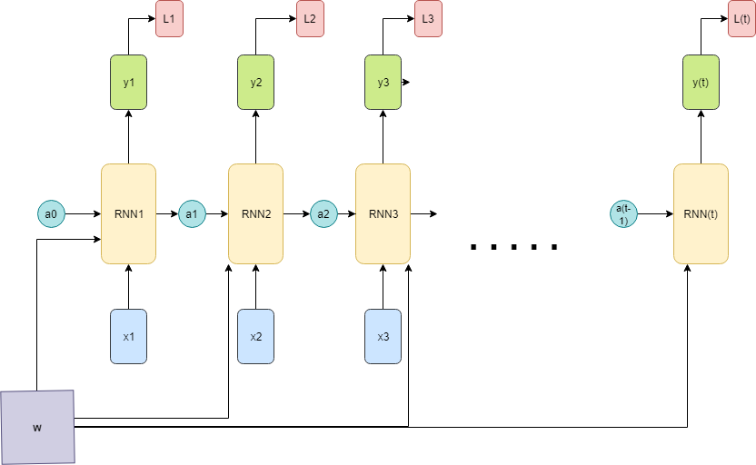

# Recurrent Neural Networks
Do you like detective stories? If you don't even like these stories I hope at least you know one of them. Have you ever noticed in most detective stories the criminal is the one who seems trustworthy from the very beginning? But in the end, the detective somehow figures out who is the real criminal?

- So, Why the others cannot figure this out?
   - Because they think like a neural network. They judge people depending on different plots of the stories but never connecting those plots. So in different timelines, they consider different people as Criminal.
- And How does the detective find out?
   - Because he is smart enough to think like a Recurrent Neural Network. He considers each & every plot of the story and after connecting the clues from different timelines he figures out who is the real criminal.

I hope you've already got the idea, right? A recurrent neural network has the power of connecting events from past to present to get the actual result. When it calculates a result, it can loop through the previously visited nodes(events) and produce a result after connecting the dots.

So, Now we know the basic concept of RNN and I assume you have enough theoretical and practical knowledge of NN and CNN. Let's dive deep into it technically.

An RNN uses inputs from previous stages to help a model remember its past. So, it is actually one kind of neural network that shares parameters in time. When it makes a decision, it takes into consideration the current input and also what it has learned from the inputs it received previously. RNN can be useful for processing sequential data where sequential inputs have a dependency on each other to find the actual output. As an example, stock prediction, natural language processing.



<br>
In this figure
the input sequence is x1, x2, x3 ...

Here activation state or the hidden state is a(where 0 <= a < t) and each individual RNN cell takes the previous activation as input and produces activation for the right next RNN cell of it. When unrolling the computational graph for multiple timesteps most of the time a0 is initialized to zero.

W is the weight matrix. Usually, we re-use the same weight matrix for each and every time step of the computation. And as Gradient flows in the backpropagation when reusing the same node multiple time(using past results in future again and again) in a computational graph then in tha backward we end up summing the gradient into the W matrix. So, in backpropagation of the model, we will have separate W following from each of the time steps and then the final gradient of the W will be the sum of all of those individual time step gradients.

y(t) is the output of each time step.

L(t) - sometimes we can calculate individual loss function for each time step (we can calculate it when we have some ground truth or label for every time step of the input sequence). These loss functions can be softmax loss(sum of individual loss) and in that case in backpropagation, we need to find a gradient of the loss with respect to W.

So, if we summerise the figure we can say each RNN cell takes a unique activation from past(at), an unique input(xt) and a common Weight matrix W and produces activation for next time step and output & loss for that time step(if getting output & loss for each time step is needed).
 
There are different kinds of RNN. We will discuss them shortly after building a basic RNN model. In this tutorial, I will work on Programming Assessment of [This](https://www.coursera.org/learn/nlp-sequence-models/home/welcome) wonderful course. 

# Building A Basic RNN

## Code Implementation
- Step 1: Building a Unit RNN cell for "Forward Propagation".
- Step 2: Building the Forward Propagation Function.
- Step 3: Building a Unit RNN cell for Backward Propagation.
- Step 4: Building the Backward Propagation Function.
- Step 5: Generating some random inputs
- Step 6: Looking into the outputs.

We will build the code step by step. But as we love to get the output first so you can download the code files from this repository and run the RNN.py and you should get 2 outputs for "Forward Propagation" and Backward Propagation. 

So, If you look into the RNN.py code you can see at first we called a DataGenerator() function to generate some random inputs. We will discuss this function a bit later. And after this function, we called our Forward Propagation Function **rnn_forward**.

### RNN Forward Propagation
For Natural Language Processing, RNN can read a sentence word by word in times and as RNN has a memory it can remember some information/context through the hidden layer activations that get passed from one time-step to the next(connecting the inputs). This allows a uni-directional RNN to take information from the past to process later inputs. 

You can get a good idea of RNN forward propagation from the following figure<br><br>


<br> <br>

So, to implement the forward propagation of the recurrent neural network described in the last figure call the **rnn_forward** which is given in ForwardPropagation.py code file. 

```Python
def rnn_forward(x, a0, parameters):
    # Initialize "caches" which will contain the list of all caches
    caches = []
    # Retrieve dimensions from shapes of x and parameters["Wya"]
    n_x, m, T_x = x.shape
    n_y, n_a = parameters["Wya"].shape
    # initialize "a" and "y" with zeros (≈2 lines)
    a = np.zeros((n_a,m,T_x))
    y_pred = np.zeros((n_y,m, T_x))
    # Initialize a_next (≈1 line)
    a_next = a0
    # loop over all time-steps
    for t in range(T_x):
        # Update next hidden state, compute the prediction, get the cache (≈1 line)
        a_next, yt_pred, cache = rnn_cell_forward(x[:,:,t], a_next, parameters)
        # Save the value of the new "next" hidden state in a (≈1 line)
        a[:,:,t] = a_next
        # Save the value of the prediction in y (≈1 line)
        y_pred[:,:,t] = yt_pred
        # Append "cache" to "caches" (≈1 line)
        caches.append(cache)
    
    # store values needed for backward propagation in cache
    caches = (caches, x)
    
    return a, y_pred, caches
```

#### Argumnets of this code

- x --> Input data for every time-step, of shape (n_x, m, T_x).
- a0 --> Initial hidden state, of shape (n_a, m)
- parameters -- python dictionary containing:
   - Waa -- Weight matrix multiplying the hidden state, numpy array of shape (n_a, n_a)
   - Wax -- Weight matrix multiplying the input, numpy array of shape (n_a, n_x)
   - Wya -- Weight matrix relating the hidden-state to the output, numpy array of shape (n_y, n_a)
   - ba --  Bias numpy array of shape (n_a, 1)
   - by -- Bias relating the hidden-state to the output, numpy array of shape (n_y, 1)
#### The function Returns
- a -- Hidden states for every time-step, numpy array of shape (n_a, m, T_x)
- y_pred -- Predictions for every time-step, numpy array of shape (n_y, m, T_x)
- caches -- tuple of values needed for the backward pass, contains (list of caches, x)

If we look through the function we see it takes the inputs described in Argument section and it loops over for T times (here T = shape of x as at every time step we take a single component of the sequence as input) and each time we are calling  **rnn_cell_forward** function(Calculating an RNN cell) and saving the output of a cell to feed into the right next cell and so and saving the final output at y_pred.

### RNN Cell Forward(Unit Cell of RNN)
A single RNN cell takes activation and weight of the previous time step as well as input & weight of the current time step and produces output & activation of the current cell. The following figure shows how a single cell of RNN works..<br><br>

<br><br>
To implement unit cell of an recurrent neural network described in the last figure call the **rnn_forward** which is given in RNN_UNIT_CELL.py code file.
## Implementation of a Single RNN Cell
```Python
    def rnn_cell_forward(xt, a_prev, parameters):
    
    # Retrieve parameters from "parameters"
    Wax = parameters["Wax"]
    Waa = parameters["Waa"]
    Wya = parameters["Wya"]
    ba = parameters["ba"]
    by = parameters["by"]
    
    # compute next activation state using the formula given above
    a_next = np.tanh( np.dot(Waa, a_prev) + np.dot(Wax, xt) + ba)
    # compute output of the current cell using the formula given above
    yt_pred = softmax(np.dot(Wya, a_next)  + by)
    
    # store values you need for backward propagation in cache
    cache = (a_next, a_prev, xt, parameters)
    
    return a_next, yt_pred, cache

```
<br>

#### Arguments of this code:
- xt --> your input data at timestep "t", numpy array of shape (n_x, m).
- a_prev --> Hidden state at timestep "t-1", numpy array of shape (n_a, m)
- parameters --> python dictionary containing:
   - Wax --> Weight matrix multiplying the input, numpy array of shape (n_a, n_x)
   - Waa --> Weight matrix multiplying the hidden state, numpy array of shape (n_a, n_a)
   - Wya --> Weight matrix relating the hidden-state to the output, numpy array of shape (n_y, n_a)
   - ba -->  Bias, numpy array of shape (n_a, 1)
   - by --> Bias relating the hidden-state to the output, numpy array of shape (n_y, 1)
#### The Function Returns:
- a_next -- next hidden state, of shape (n_a, m)
- yt_pred -- prediction at timestep "t", numpy array of shape (n_y, m)
- cache -- tuple of values needed for the backward pass, contains (a_next, a_prev, xt, parameters)

**You can look into the implementation of softmax & tanh function in our rnn_utils.py file**