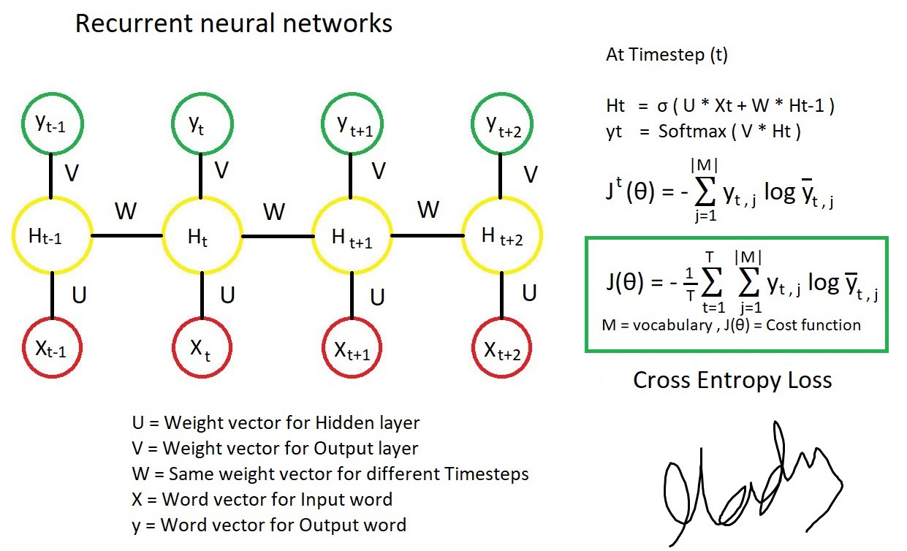

# Recurrent Neural Networks
Do you like detective stories? If you don't even like these stories I hope at least you know one of them. Have you ever noticed in most detective stories the criminal is the one who seems trustworthy from the very beginning? But in the end, the detective somehow figures out who is the real criminal?

- So, Why the others cannot figure this out?
   - Because they think like a neural network. They judge people depending on different plots of the stories but never connecting those plots. So in different timelines, they consider different people as Criminal.
- And How does the detective find out?
   - Because he is smart enough to think like a Recurrent Neural Network. He considers each & every plot of the story and after connecting the clues from different timelines he figures out who is the real criminal.

I hope you've already got the idea, right? A recurrent neural network has the power of connecting events from past to present to get the actual result. When it calculates result, it can loop through the previously visited nodes(events) and produce a result after connecting the dots.

So, Now we know the basic concept of RNN. Let's dive deep into it technically.

A RNN uses inputs from previous stages to help a model remember its past. So, it is actually one kind of neural network that shares parameters in time. When it makes a decision, it takes into consideration the current input and also what it has learned from the inputs it received previously. RNN can be useful for processing sequential data where sequential inputs have a dependency on each other to find the actual output. As an example, stock prediction, natural language processing.

There are different kinds of RNN. We will discuss them shortly after building a basic RNN model. In this tutorial, I will work on Programming Assessment of [This](https://www.coursera.org/learn/nlp-sequence-models/home/welcome) wonderful course. 

# Building A Basic Unidirectional RNN
For Natural Language Processing, RNN can read a sentence word by word in times and as RNN has a memory it can remember some information/context through the hidden layer activations that get passed from one time-step to the next(connecting the inputs). This allows a uni-directional RNN to take information from the past to process later inputs. You can get a good idea of RNN from the following figure<br><br>


<br><br>

## Forward propagation
- Let's say we have a sentence = "x1 x2 x3 .... xn" where x(t) (where, 1 <= t <= n && and t is timestep). 
- a(t) is activation for each timestep.
- y(t) is output of each timestep.
<br> <br>

<br> <br>

To implement this, at first we have to understand how a single RNN cell works. A single RNN cell takes activation and weight of previous time step as well as input & weight of current time step and produces output & activation of current cell. The following figure shows how a single cell of RNN works<br><br>


### Implementation of a Single RNN Cell
```Python
    def rnn_cell_forward(xt, a_prev, parameters):
    """
    Implements a single forward step of the RNN-cell as described in Figure (2)

    Arguments:
    xt -- your input data at timestep "t", numpy array of shape (n_x, m).
    a_prev -- Hidden state at timestep "t-1", numpy array of shape (n_a, m)
    parameters -- python dictionary containing:
                        Wax -- Weight matrix multiplying the input, numpy array of shape (n_a, n_x)
                        Waa -- Weight matrix multiplying the hidden state, numpy array of shape (n_a, n_a)
                        Wya -- Weight matrix relating the hidden-state to the output, numpy array of shape (n_y, n_a)
                        ba --  Bias, numpy array of shape (n_a, 1)
                        by -- Bias relating the hidden-state to the output, numpy array of shape (n_y, 1)
    Returns:
    a_next -- next hidden state, of shape (n_a, m)
    yt_pred -- prediction at timestep "t", numpy array of shape (n_y, m)
    cache -- tuple of values needed for the backward pass, contains (a_next, a_prev, xt, parameters)
    """
    
    # Retrieve parameters from "parameters"
    Wax = parameters["Wax"]
    Waa = parameters["Waa"]
    Wya = parameters["Wya"]
    ba = parameters["ba"]
    by = parameters["by"]
    
    ### START CODE HERE ### (≈2 lines)
    # compute next activation state using the formula given above
    #temp =
    a_next = np.tanh( np.dot(Waa, a_prev) + np.dot(Wax, xt) + ba)
    # compute output of the current cell using the formula given above
    yt_pred = softmax(np.dot(Wya, a_next)  + by)
    ### END CODE HERE ###
    
    # store values you need for backward propagation in cache
    cache = (a_next, a_prev, xt, parameters)
    
    return a_next, yt_pred, cache

```
<br>
You can see an RNN as the repetition of the cell you've just built. If your input sequence of data is carried over 10 time steps, then you will copy the RNN cell 10 times. Each cell takes as input the hidden state from the previous cell a(t-1) and the current time-step's input data x(t). It outputs a hidden state a(t) and a prediction y(t) for this time-step.